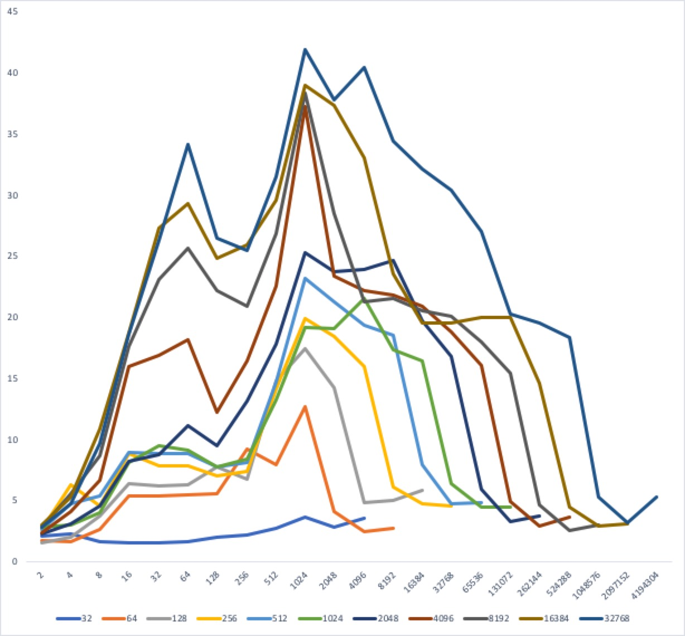
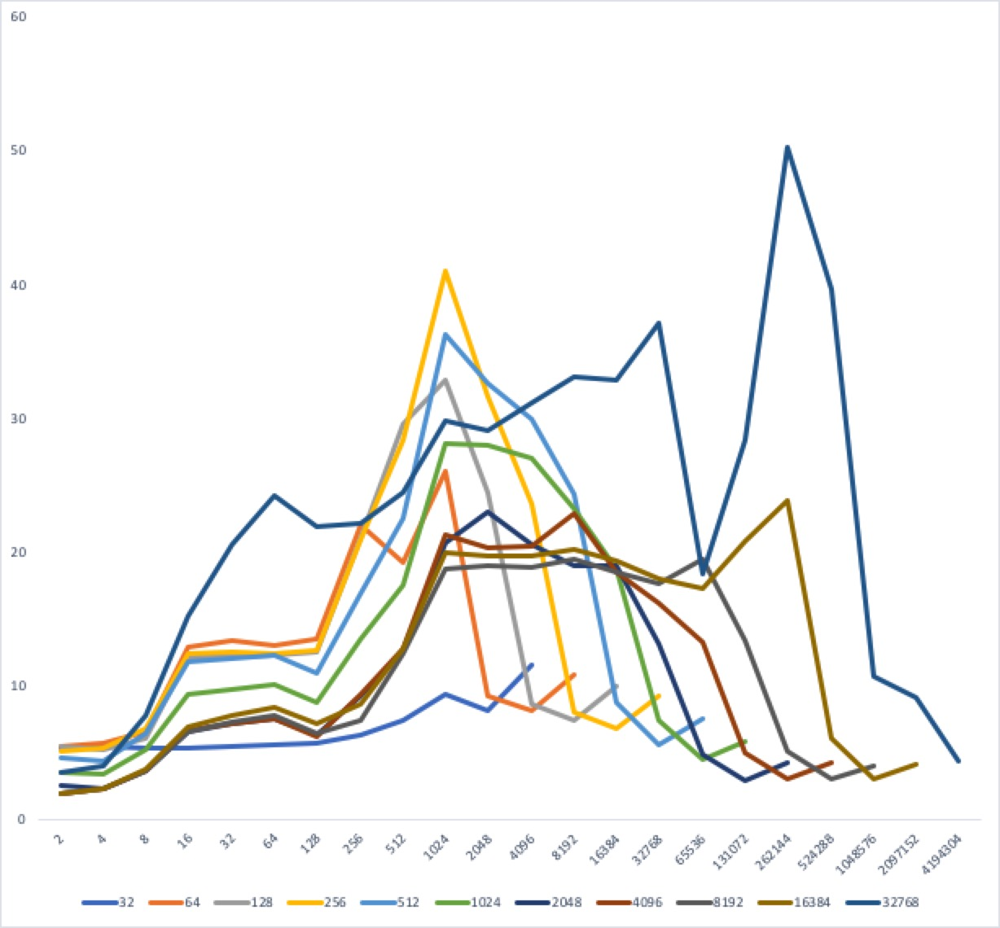

# Homework 5

The method used for estimating RAM and Cache are similar, allocate a certain size of memory and try to go throught it, and determine the size based on the time used.

## RAM

In the RAM estimation, we maintain a moving average of time used. When the used time to go through newly allocated memory suddenly increased more than 3 times of the moving average, we are almost sure that the memory is fullfilled and page swapping is triggered. At the time the memory we allocated, is the free memory available to users.

Notice that this is not necessarily the physical memory capability, since OS kernel might reserve some and there are other programs running in background too.

## Cache

Based on the paper, we go through a certain amount of memory with different stride, and estimate the average time spent on each iteration.

Figure 1 is the image generated on my laptop, Figure 2 is cache information on CCIS server.

In Figure 1, The bottom flat blue line is **32KB**, could be the **L1 cache** since this is almost no variation and the fastest. All other lines, although not exceed the size of total cache size, but added latencies between different layers of caches. The dark blue line with **2MB**, could be the size of total cache (while the actual cache of L3 is 3MB), since all larger sizes are all suddently have much higher delays.

When strip equal to 16, all lines smaller than cache sizes entered a flat platform, we could estimate the **line size of L2** would be 48 bytes. 64 is the next peak, hence **line size of L3** might be 256 bytes.

Set associativity can be spotted through the small tail, and from Figure 1, the **set associativity** should **range from 8 to 12**.

Although cache size is much larger, the information provided in Figure 2 shows other characterstics of the cache is the same in Figure 1. The L1 cache size is **32KB**, the L3 cache size would be **16MB** (proven to be 20M).